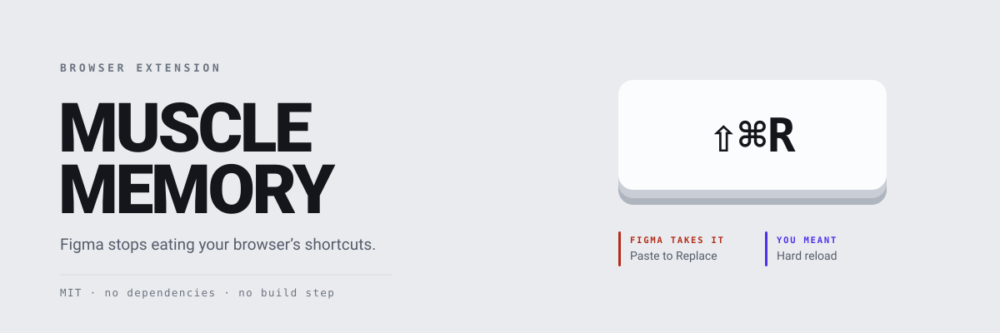

[](https://github.com/john-athan/muscle-memory/actions/workflows/ci.yml)

`⇧⌘R` in Figma is **Paste to Replace**. Press it meaning hard reload, with a
slide selected, and Figma swaps that slide for whatever is on your clipboard.
Chrome never sees the keystroke. Neither does your muscle memory, which is why
it keeps happening.

This extension gives the browser back the chords it owns, and moves the Figma
commands that lose one to a chord you already know.

**[john-athan.github.io/muscle-memory](https://john-athan.github.io/muscle-memory)**

## What changes

| Chord | Goes back to | Figma used it for | Moved to |
|---|---|---|---|
| `⇧⌘R` | Hard reload | Paste to Replace | `⌥⇧⌘V`, which Figma still ships |
| `⌘R` | Reload | Rename selection | `F2` |
| `⌘F` | Find on the page | Search the file | `⌥⌘F`, and `⌘/` still works |
| `⌘S` | Save the page | nothing at all | nothing to move |
| `⌘P` | Print | not confirmed | nothing to move |
| `⌘[` `⌘]` | Back and forward | Send backward, bring forward | `⌥⌘[` `⌥⌘]` (off by default) |

Left with Figma on purpose: `⌘D`, `⌘G`, `⇧⌘G`, `⌘=`, `⌘-`, `⌘0`. On a canvas
those read as duplicate, group, ungroup and zoom, and that is the meaning you
expect. The rule is not that the browser always wins. It is that the meaning
you expect wins.

Never at risk: `⌘N`, `⌘T`, `⌘W`, `⌘Q`. Chrome resolves those above the page, so
no website can take them.

Also included: `⇧`+right-click for the browser's own context menu, an optional
wheel that zooms instead of pans, protection for middle-click panning, and
three promotional banners that can be hidden.

## How it works

One detail of the DOM event model does most of the work. A listener registered
on `window` in the capture phase runs before any listener further down, and
listeners on the same target run in registration order. The content script runs
at `document_start`, before Figma's bundle exists, so it is first in that queue
and `stopImmediatePropagation()` means Figma's handler is never called.

The part that matters: **stopping propagation is not `preventDefault()`**. The
event still reaches Chrome's own default action. So a chord this extension
intercepts and drops behaves exactly as it would on a page with no listeners at
all, which is the whole definition of "the browser's shortcuts work". Handing a
chord back therefore needs nothing from Figma and cannot be broken by a Figma
release.

Moving a command is the other direction and is weaker. It means pressing the
old chord on Figma's behalf with a synthesised `KeyboardEvent`, and those carry
`isTrusted: false`, which an application may ignore. Rather than assume, the
extension measures: an app that acts on a shortcut calls `preventDefault` to
stop the browser also acting, and `dispatchEvent` returns `false` exactly when
that happened. The options page reports the real number and can run the check
on demand.

`⇧⌘R` is deliberately not exposed to that risk. Figma moved Paste to Replace
there from `⌥⇧⌘V` and never unbound the old chord, so the destructive rule
needs no emulation at all.

## Install

Not yet on the Chrome Web Store. Until then:

1. `git clone https://github.com/john-athan/muscle-memory.git`
2. Open `chrome://extensions`, switch on Developer mode
3. **Load unpacked**, and choose the folder

Reload any Figma tabs that were already open. Chrome does not inject content
scripts into tabs that existed before the extension did.

Chrome and Edge 116 or newer. Firefox is not supported yet: it needs a
`browser_specific_settings` block and an event-page background section.

## Honest limitations

- **Moved commands depend on Figma honouring synthesised events.** Handing a
  chord back does not. If the check says Figma ignores them, every reclaimed
  chord still works and each moved command still has another way in.
- **The banner patterns will rot.** They match on visible wording rather than
  class names, which survives a redesign better but not forever. They fail by
  hiding nothing, and they run on open files only, never on the rest of
  figma.com.
- **Figma bindings are named only where they were checked.** Where one was not
  confirmed the interface says so rather than guessing, and a test enforces it.
- **A remapped layout can put a chord out of reach.** Chords resolve by the
  character a key produces, so Dvorak and Colemak work; but where a layout puts
  `[` behind AltGr, that rule simply does not apply rather than firing wrongly.
- **Inside a Figma plugin's UI, nothing here applies.** That iframe is a
  separate document and the extension is not injected into it.

## Development

```sh
npm test         # 80 tests, no dependencies
npm run check    # referenced files, syntax, tests
npm run package  # muscle-memory.zip for the store

cargo run --release --manifest-path tools/icons/Cargo.toml   # regenerate icons
```

The keymap is data in `src/keymap.js`, shared by the content script and the
options page so the two cannot drift. Much of the suite checks that table for
mistakes that are silent at runtime: a chord reclaimed and then reused as a
destination, a destination the event constructor cannot express, a rule
fighting a chord Chrome never delivers.

`test/boot.test.js` evaluates the content scripts in manifest order against
stubs and pins the invariants everything rests on: the listeners are
capture-phase, and a reclaimed chord has its propagation stopped and its
default **not** prevented. Adding a `preventDefault()` to that path would turn
every reclaimed chord into a dead key, which is the one regression that would
otherwise ship quietly.

See [CONTRIBUTING.md](CONTRIBUTING.md) before adding a chord, and
[SECURITY.md](SECURITY.md) for reporting anything security-relevant.

## Licence

MIT. See [LICENSE](LICENSE) and [THIRD_PARTY.md](THIRD_PARTY.md).

Not affiliated with Figma, Inc. "Figma" is their trademark, used here only to
say what this works with.
